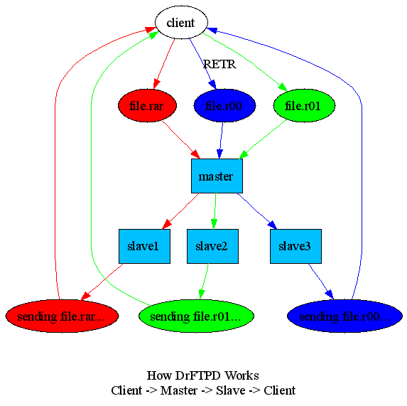

DrFTPD has two types of nodes
* Master
* Slave

This flowchart illustrates a use-case where a user request to FXP 3 files to another FTP-server and how each requested file might (or might not) be on separate `slave` servers.

How files are distributed depends on the rules in your `slaveselection` configuration.

